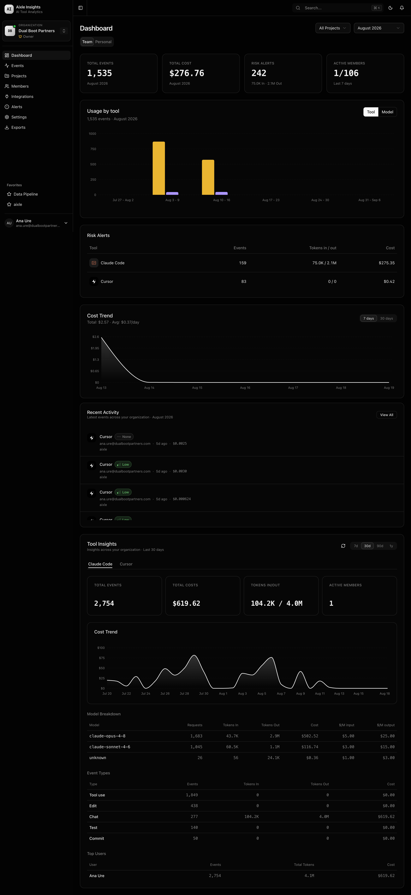

# Aixle Insights

> AI tool analytics for engineering teams — track usage, cost, and risk across Claude, ChatGPT, Copilot, and 10+ other tools.

[](https://github.com/AixleHQ/insights/actions/workflows/ci.yml)
[](https://www.npmjs.com/package/@aixle/insights)
[](LICENSE)
[](https://github.com/AixleHQ/insights)



## What it does

Aixle Insights connects to your team's AI coding tools, ingests usage telemetry, sanitizes it (redacting secrets and PII), and surfaces token consumption, cost breakdowns, and risk scores on dashboards — attributed to people and projects.

Supported sources: Claude Code, Cursor, GitHub Copilot, ChatGPT, Anthropic API, OpenAI API, Gemini, OpenRouter, Jira, Linear, GitHub, GitLab, Bitbucket.

## Quickstart

**Prerequisites:** [Docker](https://docs.docker.com/get-docker/) and Docker Compose.

```bash
git clone https://github.com/AixleHQ/insights.git && cd insights
cp .env.example .env && cp packages/web/.env.example packages/web/.env
make setup                    # builds containers, starts services, seeds sample data
```

Open [http://localhost:5173](http://localhost:5173). Log in via Keycloak ([localhost:8080](http://localhost:8080), admin/admin → realm `db90` → create a user). First login creates your account — see the [Quickstart →](https://aixlehq.github.io/insights/quickstart) for how to connect a tool and start seeing data.

> `make setup` runs: `build` → `up` → `db-create` → `db-migrate` → `db-seed`. Full service list in the Quickstart guide.

## Documentation

| | |
|---|---|
| **[Quickstart guide →](https://aixlehq.github.io/insights/quickstart)** | Detailed installation, connector setup, environment variables |
| **[User Guide →](https://aixlehq.github.io/insights/guide/connectors)** | Connecting tools, configuring ingestion, managing teams |
| **[Architecture →](https://aixlehq.github.io/insights/reference/architecture)** | System design, data pipeline, technology stack |
| **[CLI / MCP Reference →](https://aixlehq.github.io/insights/reference/cli)** | `@aixle/insights` npm package — push events, MCP server |
| **[Contributing →](CONTRIBUTING.md)** | Dev setup, branching, DCO sign-off |
| **[Roadmap →](ROADMAP.md)** | What's coming next |

## Stack

| Layer | Technology |
|---|---|
| Frontend | React 19, Vite 8, TypeScript, Tailwind CSS 4, shadcn/ui |
| Backend | Rails 8.1 (API-only), PostgreSQL 17 + TimescaleDB |
| Auth | Keycloak (OIDC), optional Google social login |
| Async | Temporal.io (durable ingestion workflows), Sidekiq |
| Storage | MinIO (S3-compatible), Redis |

## Contributing

Aixle Insights is open source under the [Apache 2.0 License](LICENSE). Contributions are welcome — see [CONTRIBUTING.md](CONTRIBUTING.md) for setup instructions and the [Code of Conduct](CODE_OF_CONDUCT.md).

External PRs require a DCO sign-off (`git commit -s`). See [CLA.md](CLA.md) for status.

## Security

Please do not report security vulnerabilities through public GitHub issues. Use [GitHub's private vulnerability reporting](https://github.com/AixleHQ/insights/security/advisories/new) instead. See [SECURITY.md](SECURITY.md) for details.

## License

Apache License 2.0 — see [LICENSE](LICENSE) and [NOTICE](NOTICE).
© 2026 Dualboot Partners, LLC.
