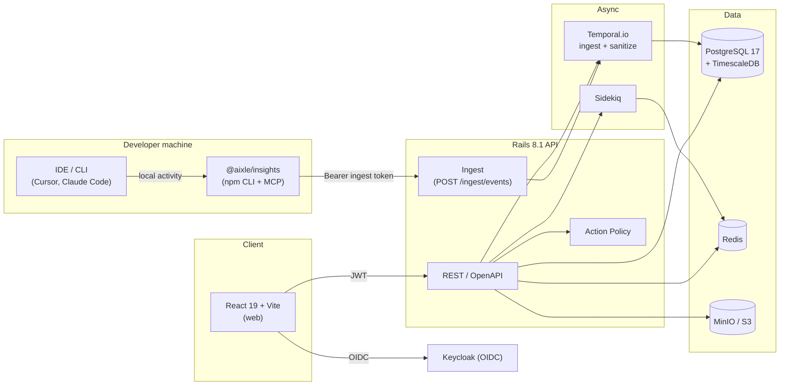

# Architecture

## What it does

An analytics platform for AI coding-tool usage. Aixle Insights ingests telemetry from connected tools, sanitizes it (redacting secrets and PII), costs it, attributes it to people and projects, and presents dashboards.

Aixle Insights does not generate AI — it observes and reports on AI-tool usage.

## Monorepo layout

```
insights/
├── packages/
│   ├── api/        # Rails 8.1 API-only (port 3000)
│   ├── web/        # React 19 + Vite 8 frontend (port 5173)
│   └── tools/      # @aixle/insights CLI + MCP server (npm)
├── temporal/       # Temporal.io workflow workers
├── keycloak/       # Realm config and custom themes
└── docker-compose.yml
```

## System overview



## Ingestion pipeline

Events flow from IDE tools → CLI collector → API ingest → Temporal durable workflow → sanitized storage:

1. `@aixle/insights` CLI reads local tool activity (Claude Code JSONL transcripts, Cursor SQLite store)
2. Batched events are posted to `POST /api/v1/ingest/events` with a per-user Bearer ingest token
3. Rails enqueues a Temporal workflow for each batch
4. The Temporal worker runs sanitization (PII/secret redaction), costing, and attribution
5. Sanitized events land in the `tool_events` TimescaleDB hypertable
6. Continuous aggregates (hourly/daily) power the dashboard queries

Raw events are quarantined in MinIO during processing and purged on the retention schedule.

## Stack

| Layer | Technology |
|---|---|
| Backend | Rails 8.1 API-only — `app/services/`, `app/query_builders/`, `app/policies/` |
| Database | PostgreSQL 17 + TimescaleDB — `tool_events` hypertable, continuous aggregates |
| Frontend | React 19, Vite 8, TypeScript, shadcn/ui, TanStack Query, React Router |
| Async | Sidekiq (standard jobs) + Temporal.io (durable ingestion/sanitization workflows) |
| Auth | Keycloak (OIDC), optional Google social login |
| Storage | MinIO (encrypted raw events), Redis (cache / Sidekiq / ActionCable) |

## Ports (local dev)

| Service | Port |
|---------|------|
| Rails API | 3000 |
| Vite web | 5173 |
| Keycloak | 8080 |
| Temporal UI | 8088 |
| MinIO console | 9001 |

## Deep dives

- Source code: [`packages/api/`](https://github.com/AixleHQ/insights/tree/main/packages/api)
- Contributing: [Contributing →](/guide/contributing)
